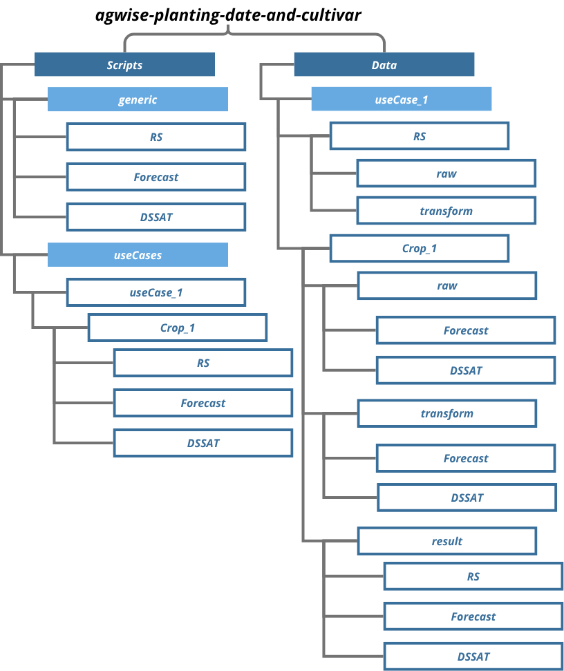

```{r setup, include=FALSE}
knitr::opts_chunk$set(echo = TRUE)
```

# The AgWise platform

<span style="text-align:justify;">The AgWise platform offers a comprehensive, modular framework for generating **climate-informed, spatially targeted agricultural advisories** tailored to the needs of smallholder farmers across sub-Saharan Africa. It integrates remote sensing (RS), seasonal climate forecasts, process-based crop simulation, and statistical analytics to produce decision-relevant outputs such as optimum planting dates, cultivar suitability options, fertilizer optimization, and yield risk outlooks—tailored to local conditions. In order to make recommendations for the forementioned decision-relevant outputs, estimates are required. These are obtained from three different approaches: mechanistic crop models (DSSAT or APSIM), statistical and machine learning models, and simple crop models (QUEFTS). This document present the framework for DSSAT - Decission Support System for Agrotechnology Transfer. 

To achieve this integration, AgWise is structured around three tightly linked technical components. Remote Sensing provides spatially explicit observations of actual cropping patterns and planting dates; the Climate Forecast component delivers bias-corrected, seasonally relevant climate information; and a crop model that combines these inputs to simulate crop performance under forecast conditions. Together, these components form a coherent pipeline that converts climate signals into decision-ready agricultural insights.


AgWise supports a probabilistic, risk-aware advisory system that is robust under uncertainty by simulating multiple cultivars and planting dates across different ensemble members. The model outputs are validated through a multi-tiered approach using statistical metrics, remote sensing-based SOS benchmarks, and historical records from national institutions. Outputs are delivered through web dashboards, APIs, and mobile platforms to ensure accessibility and last-mile relevance. </span>

# The DSSAT workflow architecture

<span style="font-family:helvetica; text-align:justify;"> The DSSAT workflow is organised in two main folders hosted in **agwise-dssat-workflow** (Figure 2):

-   <b>Scripts</b>: It contains all the scripts needed to run the remote sensing, forecasting and crop model components: <span style="color:blue;">*agwise-dssat-workflow/Scripts*
-   <b>Data</b>: It contains the input and output data of the remote sensing, forecasting and crop model components: [*agwise-dssat-workflow/Data*]{style="color:blue;"}

## Scripts folder

<span style="font-family:helvetica; text-align:justify;"> The **Scripts** folder contains two sub-folders:

-   <b>generic folder</b>: It contains generalizable scripts with the main and helper functions that are called by use case scripts (specific country, use case, crop combinations, and experiment type). Each component has it's own subfolder:
    -   <b>RS</b>: It contains the generic scripts of the remote sensing component - <span style="color:blue;"> *agwise-dssat-workflow/Scripts/generic/RS*
    -   <b>ClimateForecast_BC</b>: It contains the main scripts of the forecast component - <span style="color:blue;"> *agwise-dssat-workflow/Scripts/generic/ClimateForecast_BC*
    -   <b>DSSAT</b>: It contains the generic scripts of the crop model component - <span style="color:blue;"> *agwise-dssat-workflow/Scripts/generic/DSSAT*
-   <b> useCases folder </b>: For every country, use case, crop combinations and experiment type (use of forecast estimates, factorial design of cultivars and/or fertilizers, soil source -ISDA or ISRIC-, and their combination), a unique folder is created to host specific scripts run for it. The generic structure is *useCaseName/Crop/Component* with component being RS for the remote sensing component, Forecast for the forecast component, and DSSAT for the crop model component.

</span>

## Data folder

<span style="font-family:helvetica; text-align:justify;"> The **Data** folder contains a sub-folder for every country, use case, crop, and experiment type combinations, where all the data used as input or generated by the module (output) are stored. The generic structure is *useCaseName/Crop/*. Each use case folder contains 3 sub-folders:

-   <b>Landing </b>: This folder contains the initialization files, which are used as template for the crop model, and configuration and input files that define the experiment to be run (e.g., crop, cultivar list, country or region, fertilizer applied, soil source, ...). They are DSSAT template files (\*.CUL, \*.ECO, \*.SPE, \*.MZX, \*.SOL), a factorial experiment \*.CSV file (in case of using preset planting dates and fertilizer rates) and the main configuration file \*.R (e.g., *config.R*).
-   <b>transform </b>: This folder contains intermediate (e.g., NDVI smoothed time series) and post-processed datasets generated during the workflow. For the climate section, this includes bias-corrected and spatially harmonized forecast fields, regridded climate variables, and derived agroclimatic indicators such as rainfall onset dates, dry-spell characteristics, and extreme climate indices. Please note that since the processed NDVI data can be used for every crop of a specific use case, the data are stored at the useCase level. For DSSAT, it will contain the direct model inputs and raw model outputs. Each component of the module, RS, Forecast and DSSAT has its own sub-folder.
-   <b>result </b>: It contains the final results of the module, this includes advisory-ready bias corrected dailly seasonal forecasts, agroclimate-derived variables used for crop risk analysis, forecast skill assessment outputs and DSSAT-initialization datasets (onset of rainfall forecast & SOS - DOY). Each component of the module, RS, Forecast and DSSAT has its own sub-folder. In addition, contains the final, decision-ready outputs of the module which stores DSSAT simulation outputs, which explicitly integrate inputs from both the Remote Sensing (RS) and Climate Forecast components—such as bias-corrected climate forecasts, observed and forecast-derived agroclimatic variables and RS-based SOS indicators—into crop growth, yield, and risk simulations. The output includes, optimum planting date, yield, fertilizer rate estimates. These integrated outputs represent the final products used for agricultural risk assessment, advisory generation, and decision support.



*To be updated when we have an idea how to organize it*


# <span style="color:#CD3333; background-color:#FFE4C4; font-family:helvetica;"> The Crop modelling component

<span style="font-family:helvetica; text-align:justify;"> **Background**: The objective of the **CM** (crop model) component is to generate spatially explicit crop yield simulations using process-based models. These simulations are based on predefined cropping windows from the remote sensing component (and may be supported by the forecast component) and cultivar specific parameters. The modelling is conducted at varying spatial scales, typically at a 0.5 degree resolution. The crop modelling component relies on 3 types of input data:

**Cultivar information**: Cultivar coefficients are generated through calibration and validation process using long term experimental data sets that include historical crop yields, crop management and agro-ecological conditions. These coefficients represent the genetic parameters needed by DSSAT to accurately simulate crop growth.

**Geospatial data**: Once calibrated, the crop model is spatialized by coupling it with geospatial weather and soil datasets. The key geospatial inputs include: Rainfall-Min and Max temperature (CHIRPS); Solar radiation (AgERA5); Soil data (Soil grids or ISDA). 

**Seasonal forecast**: The seasonal forecast data is at a 9-month horizon (ECMWF). The crop yield simulations the data will be analysed to determine optimum sowing dates for specific cultivars and predicted seasonal forecast information.  

**Fertilizer rates**: Application of NPK rates for the CM simulation. Some nutrients may not be available for certain crops (e.g., Maize response to K is not available in DSSAT). The fertilizer rates may be defined from a \*.CSV file in the Landing folder or as a search grid in the *Landing/config.R* file.
</span>

## <span style="color:#CD3333; font-family:helvetica;"> The CM component scripts

# Running the DSSAT workflow

1. Copy and rename the Scripts and Data project directories, e.g., *"/home/jovyan/agwise-dssat-workflow/Scripts/useCases/UseCase_Country_Template/Maize"* and *"/home/jovyan/agwise-dssat-workflow/Data/useCase_Country_Template/Maize*". Notice the definition of the country (*Country*, e.g., *Kenya*), useCaseName (*Template*, e.g., *FertilizerRec*), and Crop (*Maize*), replace them as convenient.

2. Define your settings in the *Data/useCase_Country_Template/Maize/Landing/DSSAT/config.R* file, and your *project_root* in the *"agwise-dssat-workflow/Scripts/useCases/UseCase_Country_Template/Maize/DSSAT/run_DSSAT_Template.R"*, e.g., *"/home/jovyan/agwise-dssat-workflow"*.

3. Rename the main script with your useCaseName (*Template* in this example) for covenience ( *"agwise-dssat-workflow/Scripts/useCases/UseCase_Country_Template/Maize/DSSAT/run_DSSAT_Template.R"*).

4. **WIP** Currently it is necessary to initialize the data-sourcing directory with the files. The simplest way to do this is to copy and rename with your useCaseName an existing folder for your country. Later on, this will be managed automatically through this workflow.

5. Run the main use case script *"run_DSSAT_Template.R"*.

# The DSSAT workflow structure

The DSSAT workflow is composed of 4 steps:

- <b> Step 1: Create weather and soil data in DSSAT format for AOI data <b> 
This step sources the main and helper functions required from *"/Scripts/generic/DSSAT/readGeo_CM_zone.R"*. It creates the necessary weather and soil files for the DSSAT simulations. It also creates the AOI file in *"data_curation/AOI_GPS.RDS"*. A folder is created for each variety, zone and set of coordinates.

- <b> Step 2: Create DSSAT input files and run DSSAT simulations <b> 
This step modifies a DSSAT experimental template located in the *Landing* folder with the settings defined in the *config.R* file. Main and helper functions required are sourced from *"/Scripts/generic/DSSAT/DSSAT_expfile.R"*.
Then, the simulations are run for each coordinates looping through zones and varieties. The main and helper functions required are sourced from *"/Scripts/generic/DSSAT/dssat_exec.R"*.

- <b> Step 3: Merge DSSAT results <b> 
Results are merged and slightly formatted. The main functions are located in *"/Scripts/generic/DSSAT/merge_DSSAT_output.R"*.

- <b> Step 4: Produce response statistics and plots <b> 
Finally, some basic plots and statistics are produced. The functions used are dependent on the experiment type and, currently, it is necessary to change the functions, inputs and parameters in the main script *"run_DSSAT_Template.R"*. The main and helper functions to create plots and statistics are located in *"/Scripts/generic/DSSAT/DSSAT_analyze_results.R"*.
